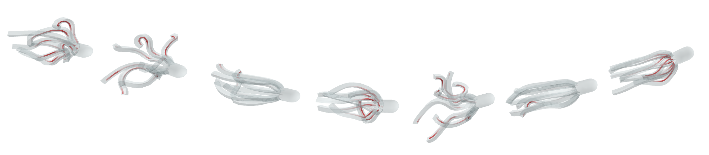

# SoftCon: Simulation and Control of Soft-Bodied Animals with Biomimetic Actuators


<p align="center">
<i>The octopus swims by actuating muscles embedded in the soft tissues.</i>
</p>

## Abstract
SoftCon is an open source code that implements the work [SoftCon: Simulation and Control of Soft-Bodied Animals with Biomimetic Actuators](http://mrl.snu.ac.kr/publications/ProjectSoftCon/SoftCon.html). With our framework, user can generate the swimming animation of under-water animals with deformable body simulator, biomimetic muscle pattern generator, and swimming controller based on deep reinforcement learning. This code is written in C++ and Python, based on [Tensorflow](https://github.com/tensorflow/tensorflow) and [OpenAI Baselines](https://github.com/openai/baselines). 

## Publication

Sehee Min, Jungdam Won, Seunghwan Lee, Jungnam Park, and Jehee Lee. 2019.
SoftCon: Simulation and Control of Soft-Bodied Animals with Biomimetic Actuators.
ACM Trans. Graph. 38, 6, 208. (SIGGRAPH Asia 2019)

Project page : [http://mrl.snu.ac.kr/publications/ProjectSoftCon/SoftCon.html](http://mrl.snu.ac.kr/publications/ProjectSoftCon/SoftCon.html)  
Paper : [http://mrl.snu.ac.kr/publications/ProjectSoftCon/SoftCon.pdf](http://mrl.snu.ac.kr/publications/ProjectSoftCon/SoftCon.pdf)  
Youtube : [https://www.youtube.com/watch?v=I2ylkhPSkT4](https://www.youtube.com/watch?v=I2ylkhPSkT4)  
Blog : [http://mrl.snu.ac.kr/blog/ProjectSoftCon](http://mrl.snu.ac.kr/blog/ProjectSoftCon)  


## How to install

We recommend users to install and run this framework on Ubuntu. We checked code works in Ubuntu 16.04 and 18.04. 


### C++ 
#### Basic C++ library
```
sudo apt-get update
sudo apt-get install build-essential cmake-curses-gui git
sudo apt-get install libeigen3-dev freeglut3-dev libtinyxml-dev libpython3-dev python3-numpy libopenmpi-dev
```
#### Boost 1.66 with Python3 : **Boost library should install from the source code!**  
- Download Boost 1.66 source code as zip file in [https://www.boost.org/users/history/version_1_66_0.html](https://www.boost.org/users/history/version_1_66_0.html).
- Unzip the file. ``` tar -xvf boost_1_66_0.tar.gz ```
- Compile and install the source code.
```
cd boost_1_66_0
sudo ./bootstrap.sh --with-python=python3
sudo ./b2 --with-python --with-filesystem --with-system install
```

### Python
#### Virtual environment
````
sudo apt-get install python3-pip
sudo pip3 install virtualenv
virtualenv venv
source venv/bin/activate
````

#### Python library with pip install
````
pip install numpy
pip install scipy
pip install matplotlib
pip install tensorflow
pip install mpi4py
pip install OpenCV-Python
````

#### Baselines Installation for Deep RL
* OpenAI Gym
```
pip install gym
```
* OpenAI Baselines
```
sudo apt-get update && sudo apt-get install cmake zlib1g-dev
git clone https://github.com/openai/baselines.git
cd baselines
pip install -e .
```

## How to compile & run

### Install this repository
```
git clone http://github.com/seiing/SoftCon
```

### Build
```
cd SoftCon
mkdir build
cd build 
cmake ..
make -j8
```

### Run
#### Default render
```
./render/render
```

* ```space``` : play/pause.
* ```k``` : play with default key.
* ```r``` :reset the scene.

#### Render with trained network
```
./render/render (network_name)
```

#### Training
```
cd SoftCon/learn
mpirun -np 8 python3 -m run --type=train
```

## Contact us
- For bug reports/requests/suggestions, use github issues. 
- For private inquiries, feel free to contact us at: sehee@mrl.snu.ac.kr
